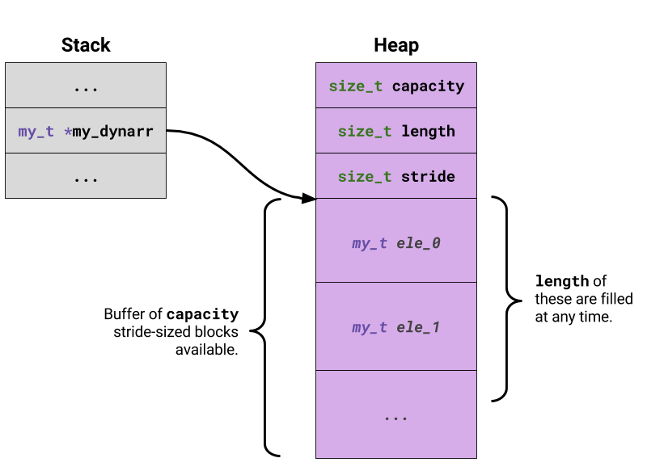

# dynarray
A generic dynamic array implementation in C.

## Example Usage

```c
#include "dynarray.h"

int *ints = dynarray_create(int);

for (int i = 0; i < 10; i++)
    dynarray_push(ints, &i);

for (int i = 0; i < dynarray_length(ints); i++)
    printf("ints[%d] -> %d\n", ints[i]);
```
Output:
```
ints[0] -> 0
ints[1] -> 1
...
ints[8] -> 8
ints[9] -> 9
```

## Memory Layout
The array is heap-allocated and is prefixed with a three-field header containing the buffer's `capacity`, `length`, and `stride`.

* The `stride` is calculated at creation time as `sizeof(T)` where `T` is the datatype you intend to store.
* The `capacity` field stores the buffer's size.
* The `length` field keeps track of the number of elements stored in the buffer.

Macros defined in [`dynarray.h`](dynarray.h) allow the `capacity`, `length`, and `stride` attributes to be accessed.

The dynarray is referred to _only_ by a pointer to the first element in the buffer. This allows the dynarray to be passed to most functions that were meant to operate on normal C-arrays.


